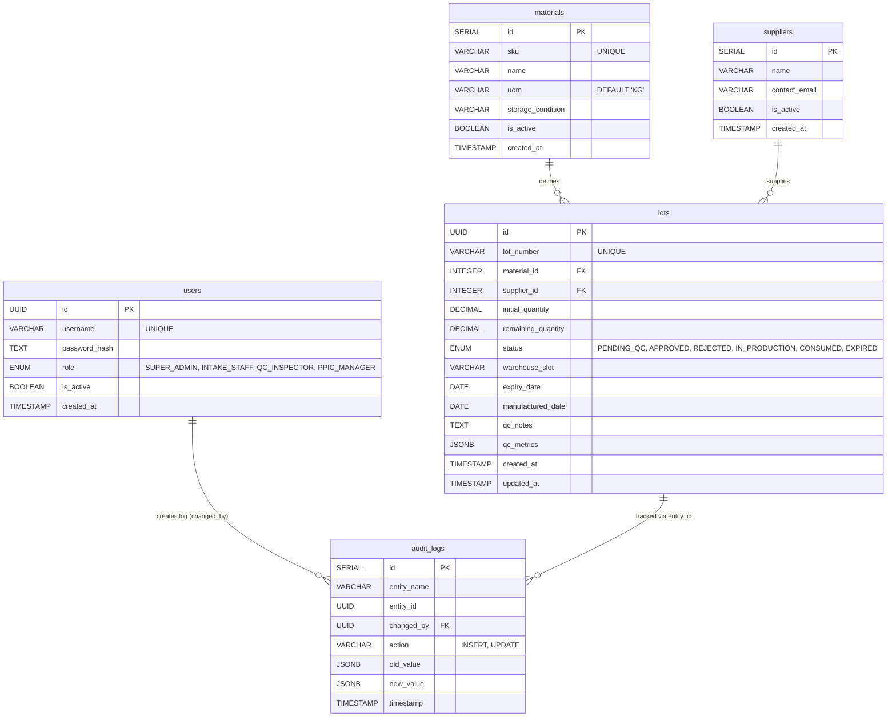

# CyberHack 2026: Sima Arome ERP Lite

Expert Enterprise ERP Lite system for Sima Arome (Natural Extracts, F&B, and Cosmetics Industry).

## 🚀 Quick Start (Docker - Recommended)

The easiest way to get everything running is using Docker Compose.

### 1. Prerequisites
- [Docker](https://docs.docker.com/get-docker/) installed.
- [Docker Compose](https://docs.docker.com/compose/install/) installed.

### 2. Setup Environment
Clone the `.env.example` file to `.env` (already done in this repo for your convenience, but good to know):
```bash
cp .env.example .env
cp backend/.env.example backend/.env
```

### 3. Run with Docker Compose
From the root directory, run:
```bash
docker-compose up -d --build
```
This will start:
- **PostgreSQL** on port `5434`
- **Backend (FastAPI)** on port `8000`
- **Frontend (Next.js)** on port `3001`

### 4. Seed Initial Data
Once the containers are up, initialize the database with test users and master data:
```bash
docker-compose exec backend python app/scripts/seed_master_data.py
```

### 5. Access the Application
- **Frontend:** [http://localhost:3001](http://localhost:3001)
- **API Docs (Swagger):** [http://localhost:8000/docs](http://localhost:8000/docs)

---

## 🛠 Manual Setup (Local Development)

If you prefer to run the components separately without Docker:

### 1. Backend (FastAPI)
1. Navigate to the `backend` folder.
2. Create and activate a virtual environment:
   ```bash
   python -m venv venv
   source venv/bin/activate  # On Windows: venv\Scripts\activate
   ```
3. Install dependencies:
   ```bash
   pip install -r requirements.txt
   ```
4. Run the development server:
   ```bash
   uvicorn app.main:app --reload
   ```

### 2. Frontend (Next.js)
1. Navigate to the `frontend` folder.
2. Install dependencies:
   ```bash
   npm install
   ```
3. Run the development server:
   ```bash
   npm run dev
   ```
   The frontend will be available at [http://localhost:3000](http://localhost:3000).

---

## 🔑 Authentication & MFA (OTP)

This system uses a secure Two-Step Verification (MFA) flow.

1. **Login:** Enter your username and password.
   - **Default Admin:** `admin` / `admin123`
2. **OTP Verification:** After clicking Sign In, the system generates a 6-digit OTP.
3. **Check OTP:** Since this is a development environment, the OTP is printed to the **Backend Logs**.
   - If using Docker: `docker-compose logs -f backend`
   - Look for the `[MOCK EMAIL SENT]` block.
4. **Enter OTP:** Copy the code from the logs and enter it in the frontend to complete the login.

---

## 📊 Database Schema (ERD)



## Tech Stack
- **Backend:** FastAPI (Python)
- **Frontend:** Next.js (React) + Tailwind CSS
- **Database:** PostgreSQL
- **Deployment:** BuildPad / AWS / Vercel
