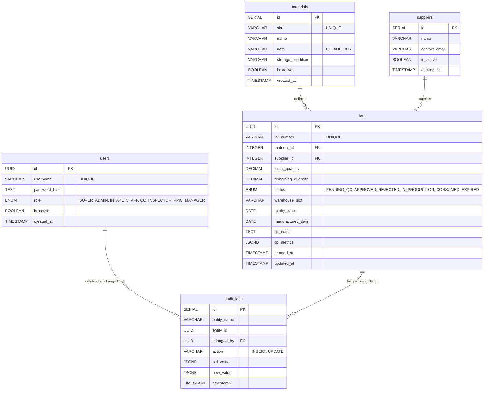

# CyberHack 2026: Sima Arome ERP Lite

Expert Enterprise ERP Lite system for Sima Arome (Natural Extracts, F&B, and Cosmetics Industry).

## Database Schema (ERD)

## Tech Stack
- **Backend:** FastAPI (Python)
- **Frontend:** Next.js (React) + Tailwind CSS
- **Database:** PostgreSQL
- **Deployment:** BuildPad / AWS / Vercel
